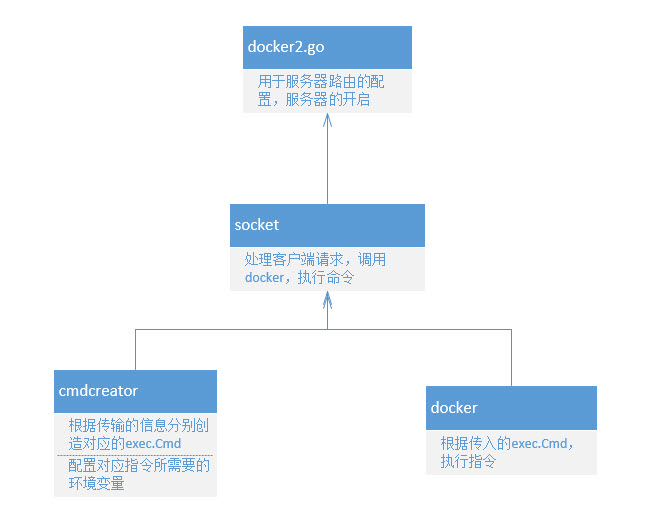

# docker go get实现思路

> Author：huziang </br>
>
> Date：18.2.4

## 程序结构

文件结构如下：

```bash
├── cmdcreator
│   ├── cmdcreator.go
│   └── goCMD.go
├── docker
│   └── docker.go
├── docker2.go
└── socket
    └── socket.go
```

依赖关系如下：




其中，docker2.go是运行文件，程序的主入口。

## 逻辑概述

1. 客户端连接8081端口，传输为了执行go get命令的参数给服务端。其中，传输的数据中需要包含UserName，Entrypoint[0]两个字段，分别代表请求的用户姓名和go get参数后面的url。
2. 服务端收到数据，解析出UserName和Entrypoint[0]两个字段，通过cmdcreator包，将docker内\$GOROOT路径替换成本机\$GOROOT路径，将docker内$GOPATH路径替换成该用户存放文件的文件夹(...../home/username)'
3. 服务端创造exec.Cmd指针，交给docker包执行
4. docker包执行指令，通过两个chan分别与socket对接stdout端和stderr端，进行实时输出。
5. 输出完毕，程序结束

## 目前所遇到问题

1. docker内的go语言环境配置，是直接使用本机环境，映射到容器内，还是使用配置好的docker镜像生成容器？
2. socket的关闭信号怎么判断，客户端还是服务端先发出关闭信号？